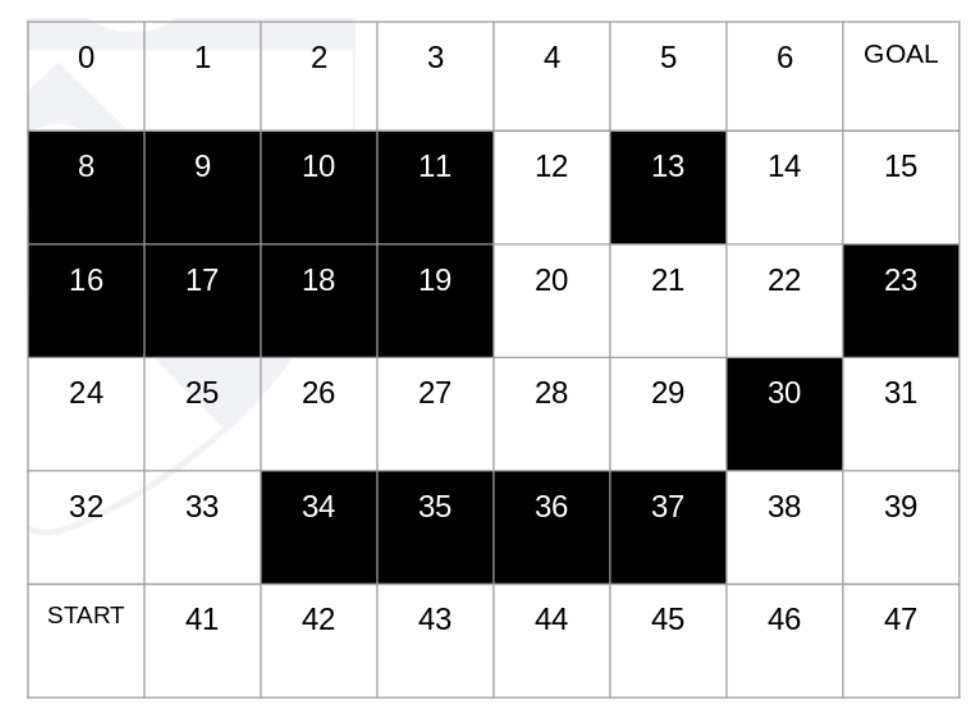
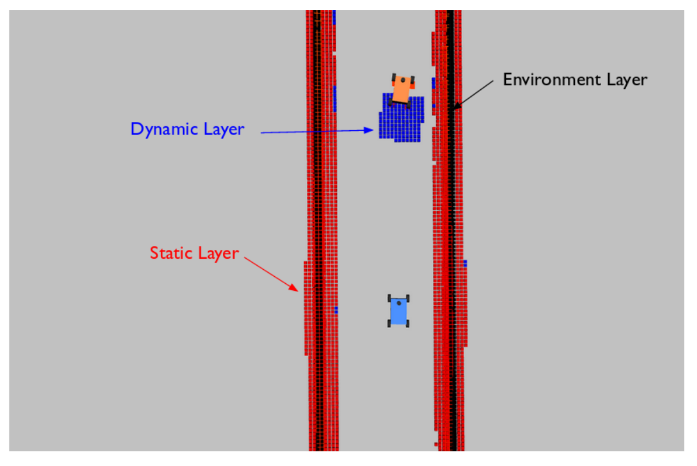
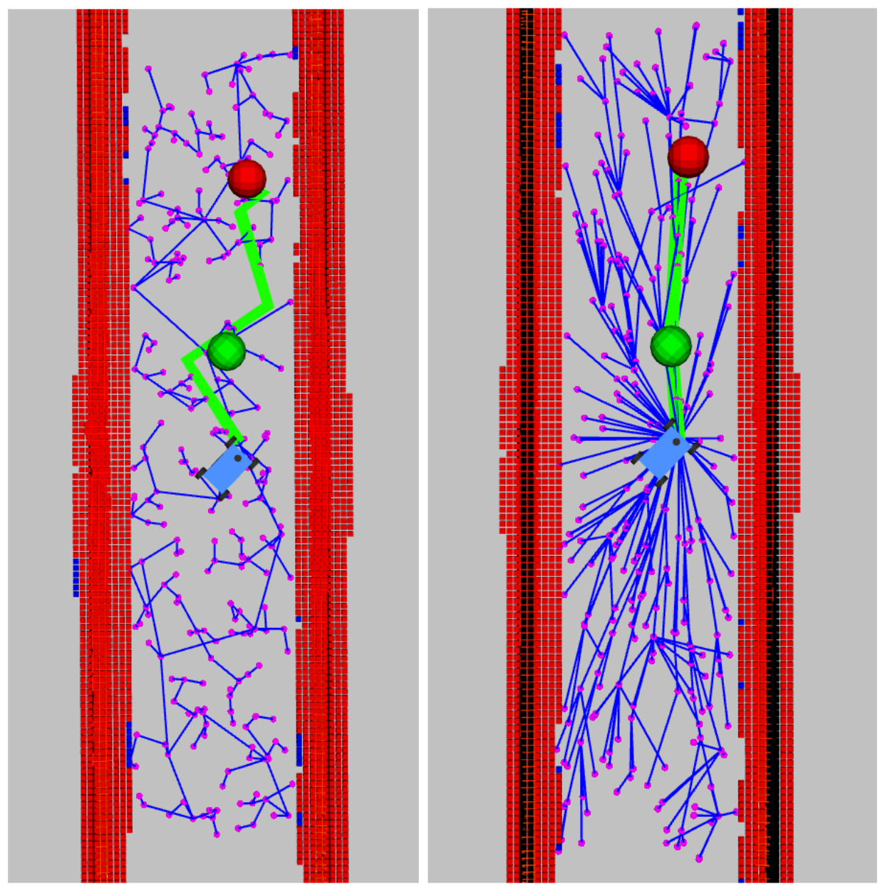

# Lab 7: Motion Planning

## I. Learning Goals

- Motion Planning basic concepts
  * Configuration space vs. Workspace: you should understand the difference between configuration space and workspace, and the advantages and disadvantages of planning in each of them.
  * Free space vs. Obstacle space: you should understand the difference between free space and obstacle space.
  * Occupancy grids and Costmaps: you should understand what occupancy grids and costmaps are, how to use them, and how to create them.
- Motion Planning algorithms
  * Grid-based search: Dijkstra's, A*, and their variants.
  * Sampling based algorithms: RRT and its variants.

## II. Overview

The goal of this lab is to provide you with tools that will help you in a head-to-head race on a race track. After finishing this lab, your car should be able to do something like [this](https://www.youtube.com/watch?v=llHCRqwIllM).

Before you start this lab, you should read the [paper](https://arxiv.org/pdf/1105.1186.pdf). Pay close attention to sections 3.1, 3.2, Algorithm 3, 3.3, Algorithm 6.

### RRT Pseudocode

The pseudocode of the basic version of RRT is listed as above. You can find all the details of the functions used by RRT in the paper. If you're implementing RRT*, or another version of RRT, read the RRT* section of the provided paper, and do some research to figure out how to modify the basic version of RRT.

### F1TENTH RRT vs. Generic RRT

In general, RRT is often used as a global planner where the tree is kept throughout the time steps. Whenever there is a new obstacle, and the occupancy grid changes, the tree will change accordingly. In our case, RRT is used as a local planner for obstacle avoidance. This is due to the fact that we don't have a well-defined starting point and goal point when we're racing on a track and we want to run continuous laps. In our implementation, we are only keeping a tree for the current time step in an area around the car. You could try to keep one tree that populates the map throughout the time steps, but speed is going to be an issue if you don't optimize how you're finding nodes, and traversing the tree.

## III. Part A: Written assignment

Use the file `lab7_solutions_template.tex` in the latex folder to type up your answers.

### Grid world planning with Dijkstra's

Figure 1

Using figure 1, write out steps for Dijkstra's algorithm (8-connected, assume uniform cost for each action). At each step, list the grid cells in the open set with their running cost and the grid cells in the visited set. Write the final path found as a list of grid cell ids.

### Grid world planning with A*

Using figure 1, write out steps for A* (8-connected, assume uniform cost for each action). At each step, list the grid cells in the open set with their f-value (use Manhattan distance to the goal as the heuristic function) and the grid cells in the visited set. Write the final path found as a list of grid cell ids.

## IV. Part B: Coding assignment

You can choose to implement RRT in either the workspace or configuration space. Since we're working with a car-like robot, the workspace will be the car's position in the world, and the configuration space will be whatever you decided to add on top of that (heading angle, velocity, etc.).

Although we have provided skeleton code in both C++ and Python, we encourage you to implement this in C++ for higher performance. Although you could vectorize your code with numpy and use libraries like numba to speed up your Python code, we haven't implemented this lab in Python and can't guarantee any good performance. For reference, the code in the video is running at around 30 Hz on the car.

### Where everything is

The C++ skeleton source code `rrt.cpp` is in the `src` directory, and the header file `rrt.h` is in the `include` directory. The skeleton code for python is in the `scripts` directory.

### Implementing an Occupancy Grid

You'll need to implement an occupancy grid for collision checking. Think about what is available to you (the map, the Laserscan messages, etc.), and construct a occupancy grid using those information. You can choose to either implement a binary occupancy grid (a grid cell is either 0 for unoccupied, or 1 for occupied), or use a probabilistic occupancy grid (a grid cell has values between 0 and 1 for probability that it is occupied). You could choose to implement either an occupancy grid in the car's local frame, or in the map's global frame. Depending on the size of the map that you use, think about how to compute updates to the occupancy grid and storing/using the occupancy grid efficiently. Since we're using RRT as a local planner, as in it comes up with a new path at every time step, you need to run everything relatively fast.  You'll also want to visualize the occupancy grid to ensure its correctness. You don't have to implement a multi-layer one like the one shown in \ref{fig:occgrid}.

Figure 2

### Working in the simulator and on the car

By this point, you should be pretty comfortable using the simulator to test your code. Since last lab, we have modified the simulator to publish the ground truth pose of the car, this would be useful for testing your algorithm in the simulator. When you test on the car, make sure you start slow, and increase your speed gradually. You'll see the effectiveness of your algorithm at a higher speed.

### Trajectory Execution

After you've found a path to your goal with RRT, there are different algorithms that you could use to follow that trajectory. The most obvious solution is Pure Pursuit that you have done from the last lab. Picking the waypoint out of the path for pure pursuit will be the most important part if you decided to go down this route. You want a balance between having the car steering smoothly, and at the same time, reactive enough to avoid obstacles. Also, up-sampling the path for pure pursuit to pick out a waypoint is a good way to go.

### Hints

Think about how you could change the way that you're sampling the free space to speed up the process of finding a path to the goal. Also think about how the restrict the area in which you're sampling to make sure you don't have too big of a tree. Besides RRT*, there are other versions of RRT that takes into consideration of other variables (the dynamics of the car for example). After you're done with the basic version of RRT, you should do some research and implement a better version of RRT.

Make sure you visualize the tree you've expanded, and the path you've chosen as the trajectory.

## V. Part C: RRT* (Extra credit)

Figure 3

You'll be rewarded extra credit (10%) for implementing RRT*, or another modified version of RRT (if you do, make a good argument on why it deserves extra credit). On top of the basic version of RRT, RRT* uses a cost function, and rewiring the tree, to find a better path to the goal. When the tree has expanded infinite number of nodes, RRT*'s solution is close to optimal. Figure 3 shows the difference in the tree expanded and path found between RRT and RRT*. The skeleton code provided has sections for functions in RRT* as well.

## V: Grading Rubric
- Compilation: **20** Points
- Written answers: **10** Points
- Performance on straight path: **30** Points
- Performance on turn: **30** Points
- Video: **10** Points
