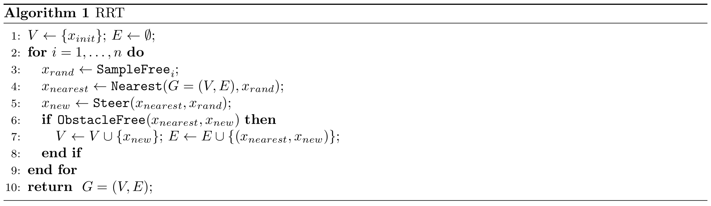

# Lab 7: Motion Planning

## I. Learning Goals

- Motion Planning basic concepts
  * Configuration space vs. Workspace: you should understand the difference between configuration space and workspace, and the advantages and disadvantages of planning in each of them.
  * Free space vs. Obstacle space: you should understand the difference between free space and obstacle space.
  * Occupancy grids and Costmaps: you should understand what occupancy grids and costmaps are, how to use them, and how to create them.
- Motion Planning algorithms
  * Grid-based search: Dijkstra’s, A*, and their variants.
  * Sampling based algorithms: RRT and its variants.

## II. Overview

The goal of this lab is to provide you with tools that will help you in a head-to-head race on a race track. After finishing this lab, your car should be able to do something like [this](https://www.youtube.com/watch?v=llHCRqwIllM).

Before you start this lab, you should read the [paper](https://arxiv.org/pdf/1105.1186.pdf}{https://arxiv.org/pdf/1105.1186.pdf). Pay close attention to sections 3.1, 3.2, Algorithm 3, 3.3, Algorithm 6.

### * RRT Pseudocode

The pseudocode of the basic version of RRT is listed as above. You can find all the details of the functions used by RRT in the paper. If you're implementing RRT*, or another version of RRT, read the RRT* section of the provided paper, and do some research to figure out how to modify the basic version of RRT.

### * F1TENTH RRT vs. Generic RRT

In general, RRT is often used as a global planner where the tree is kept throughout the time steps. Whenever there is a new obstacle, and the occupancy grid changes, the tree will change accordingly. In our case, RRT is used as a local planner for obstacle avoidance. This is due to the fact that we don't have a well-defined starting point and goal point when we're racing on a track and we want to run continuous laps. In our implementation, we are only keeping a tree for the current time step in an area around the car. You could try to keep one tree that populates the map throughout the time steps, but speed is going to be an issue if you don't optimize how you're finding nodes, and traversing the tree.\\

## III. Part A: Written assignment

Use the file `lab7_solutions_template.tex` in the latex folder to type up your answers.

### Grid world planning with Dijkstra's

Using figure 1, write out steps for Dijkstra's algorithm (8-connected, assume uniform cost for each action). At each step, list the grid cells in the open set with their running cost and the grid cells in the visited set. Write the final path found as a list of grid cell ids.

### Grid world planning with A*

Using figure 1, write out steps for A* (8-connected, assume uniform cost for each action). At each step, list the grid cells in the open set with their f-value (use Manhattan distance to the goal as the heuristic function) and the grid cells in the visited set. Write the final path found as a list of grid cell ids.

## IV. Visualizing Waypoints

To visualize the list of waypoints you have, and to visualize the current waypoint you're picking, you'll need to use the `visualization_msgs` messages and RViz. You can find some information [here](http://wiki.ros.org/rviz/DisplayTypes/Marker).

## V: Grading Rubric
- Compilation: **10** Points
- Occupancy grid init and update: **20** Points
- Correct collision check: **30** Points
- Correct find path: **30** Points
- Video: **10** Points
